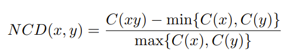

## Implementation of the arXiv paper [Less is More: Parameter-Free Text Classification with Gzip](https://arxiv.org/abs/2212.09410)
Implementing the arXiv paper [Less is More: Parameter-Free Text Classification with Gzip](https://arxiv.org/abs/2212.09410) in [Rust 🦀](https://www.rust-lang.org/) and using it in [python 🐍](https://www.python.org/) using [pyo3](https://docs.rs/pyo3/latest/pyo3/) to classify texts 📝. I implemented it in Rust, because it was easier for me to parallelize using [Rayon](https://docs.rs/rayon/latest/rayon/).

### Algorithm

1. Compute [Kolmogorov complexity](https://en.wikipedia.org/wiki/Kolmogorov_complexity) of the each texts in your training dataset. Kolmogorov complexity is nothing but the length of the shortest program that upon running, would generate the text without any loss. The author used [gzip](https://www.gnu.org/software/gzip/) as an approx. for Kolmogorov complexity.

2. To classify a given text `x`, iterate over each text `y` in your training dataset, compute the Kolmogorov complexity of your text call it `cx`, compute the Kolmogorov complexity of the concatenation of texts `x` and `y` call it `cxy`, then calculate the below distance `ncd` ([Normalized Compression Distance](https://en.wikipedia.org/wiki/Normalized_compression_distance))



3. Sort the results by the `ncds`, and take the first `k` results. This is where the [K Nearest Neighbors](https://en.wikipedia.org/wiki/K-nearest_neighbors_algorithm) comes in.

4. Then take the majority vote as the classification.


### Setup

1. Install [Python >= 3.8 🐍](https://www.python.org/downloads/release/python-380/)

2. Install [Rust 🦀](https://www.rust-lang.org/) and [Cargo](https://doc.rust-lang.org/cargo/) using [rustup](https://rustup.rs/)

3. Install below libraries in python
```console
python -m pip install pandas maturin scikit-learn
```

4. Open [Rust source code](/gzip_knn_classifier/) in command prompt, and run the following command to install `gzip_knn_classifier` in python
```console
python -m maturin develop --release
```

### Usage

Once you have installed `gzip_knn_classifier` in python, you can use it as following-

```python
import gzip_knn_classifier as gkc

# text_as_bytes should be the text encoded as bytes, e.g.- [b'some text', b'some other text', ...]
# classes_as_integers should be the integers representing each class for each text in the texts, e.g.- [1, 2, 3, 2, 3, ...]
# length of text_as_bytes and classes_as_integers must be same!
clf = gkc.new(text_as_bytes, classes_as_integers)
# the above code should train the model on your texts

# to classify a single text, use-
gkc.classify(clf, your_text)

# to classify multiple texts, use-
gkc.classify_many(clf, your_texts)
```

I have below [jupyter notebooks](https://jupyter.org/) where I have trained the model using `gzip_knn_classifier`-

|notebook|dataset|test_accuracy|
|--|--|--|
|[Medical Text Dataset -Cancer Doc Classification.ipynb](./Medical%20Text%20Dataset%20-Cancer%20Doc%20Classification.ipynb)|[Medical Text Dataset -Cancer Doc Classification.csv](./data/Medical%20Text%20Dataset%20-Cancer%20Doc%20Classification.csv)|~90%|
|[Ecommerce Text Classification.ipynb](./Ecommerce%20Text%20Classification.ipynb)|[Ecommerce Text Classification.csv](./data/Ecommerce%20Text%20Classification.csv)|~52%|

### Conclusion

The algorithm is very straightforward and easy to implement. It's really surprising that this even works. The original [paper](https://arxiv.org/abs/2212.09410) claims it performing on par with large language models like [BERT](https://en.wikipedia.org/wiki/BERT_(language_model)), although my testing showed accuracy ranging over 50-90%, which is too wide. It's definitely not ready for any real world usecase, but knowing such an algorithm exists motivates us to not forget about these traditional machine learning algorithms. Sometimes going back to first principles is what you need.

### License
Licensed under [@MIT](./LICENSE)
